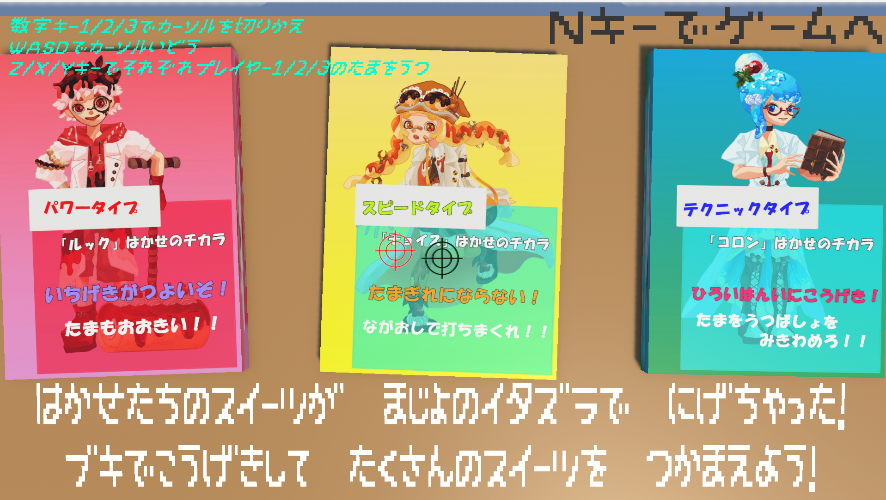
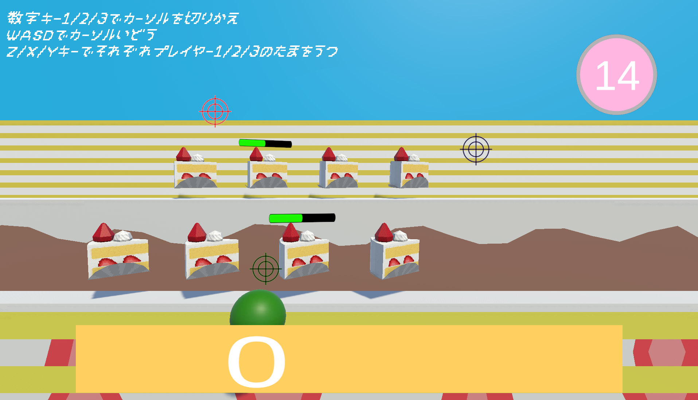

# SweetBangGet
ジャイロセンサーを用いた射撃ゲーム「SweetsBangGet」のUnityProjectリポジトリです。

「東京都立大学2026こども祭り」で展示し、当日来場した子供達に銃型コントローラーを持って体験してもらいました。

このリポジトリはコードのみですが、以下のリンクからPCですぐ中身を確認できる「SweetsBangGet.exe」をダウンロードすることができます。

[GoogleDrive](https://drive.google.com/drive/folders/1gUTS2zINzBlP5zEwkqOjjxWJk-ijq53C?usp=drive_link)

GoogleDriveの「SweetsBangGet」フォルダをまとめてダウンロード後、ファイル内の「SweetsBangGet.exe」を起動することで遊べます。

センサーを用いて遊ぶことを前提としたゲームですが、PCでもプレイが可能です

＜操作方法＞

・数字キー1/2/3で操作プレイヤー切り替え

・WASDで操作プレイヤーのカーソルを移動

・Z/X/Cキーでそれぞれプレイヤー1/2/3の弾丸を発射

となっています。

その他、場面進行はNキー(bluetooth接続画面のみBキー)で次の場面へ進みます。

 

